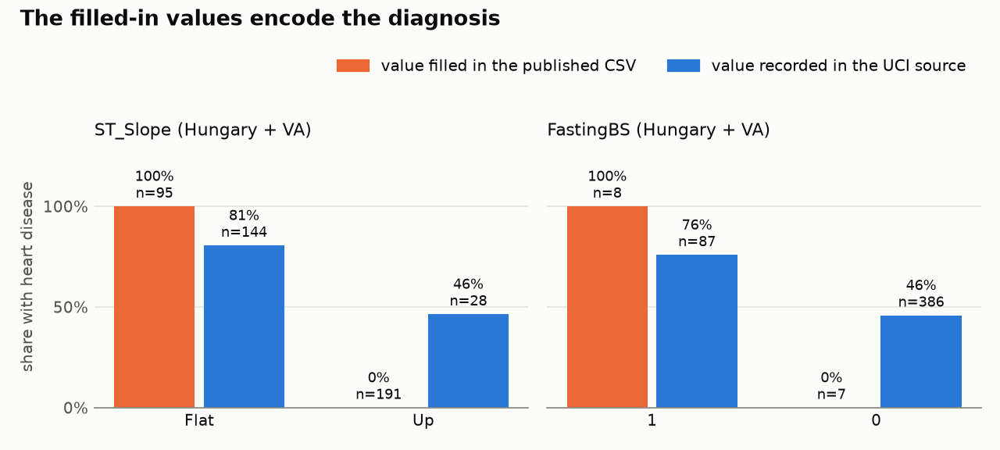
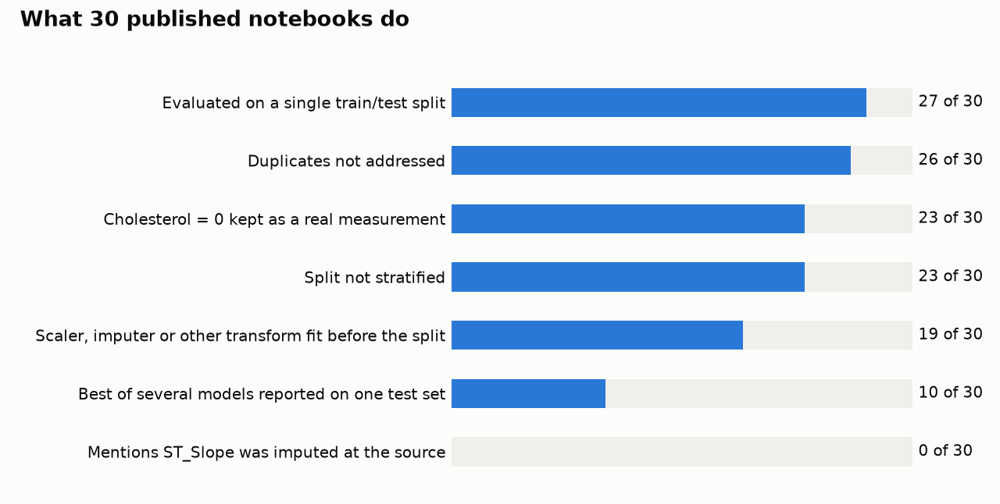
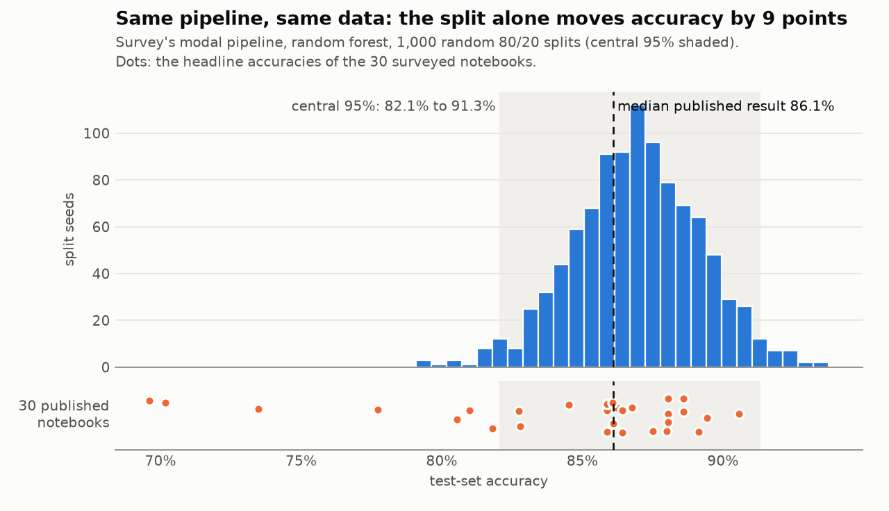
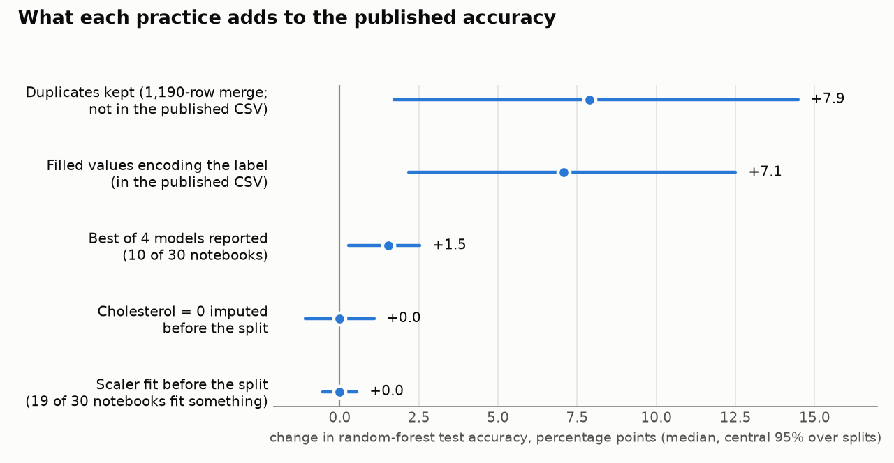
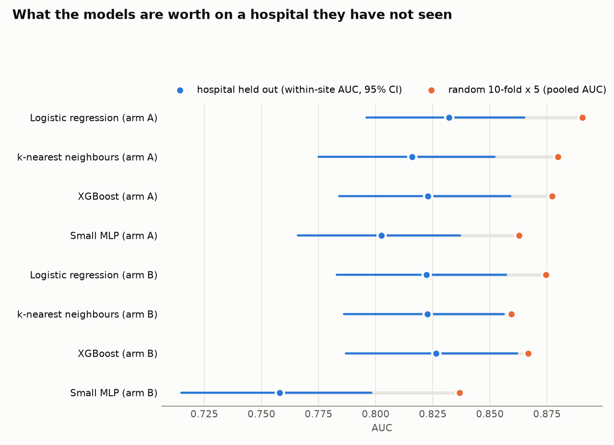

# Heart Disease Prediction: A Reproducibility Audit

[](https://github.com/ethanstoner/heart-disease-audit/actions/workflows/ci.yml)

**Python · pandas · scikit-learn · SciPy · pytest · GitHub Actions**

An audit of the Kaggle "Heart Failure Prediction" CSV, one of the most-used tabular ML datasets
on GitHub. It traces the published data back to its four UCI hospital sources and measures how
dataset construction, preprocessing, split variance and hospital leakage affect the accuracy
people report for it.

**Key result.** Every value missing from the UCI sources, in the columns the CSV keeps, was
filled in, and in four columns the filled value matches the diagnosis perfectly. The dataset's
description mentions neither. In the typical published pipeline, reverting the 644 recovered
filled cells to missing lowers median random-forest accuracy from **86.4% to 79.3%** across
1,000 paired train/test splits.



The deliverable is a set of findings, not a better accuracy score. Every number below comes
from committed code that was run, and every experiment's prediction was committed before the
experiment ran.

## Findings

### 1. The published CSV's filled-in values encode the label

- The CSV (918 rows) is the four UCI heart-disease files (920 rows) minus their 2 exact
  duplicates. The author's documented arithmetic (1,190 − 272 = 918) adds Statlog, and all 270
  Statlog rows are copies of Cleveland rows.
- The UCI files have 662 missing values in the 11 columns the CSV keeps; the published CSV has none. The dataset description
  documents the row arithmetic but never mentions missing values, `?`, imputation or filling
  (checked through Kaggle's metadata API on 2026-09-22; see
  `results/kaggle_description_check.json`).
- Matching each UCI row on only the fields it recorded pairs 912 of 918 published rows
  one-to-one with their UCI source. ST_Slope is left out of the match, and the pairs agree on it
  610 out of 610 times. The matcher recovers 644 filled cells.
- **Every filled ST_Slope is `Flat` for a patient with heart disease (111 of 111) and `Up` for a
  patient without (191 of 191).** Filled FastingBS (89 of 89, 74 of them from Switzerland) and
  ExerciseAngina (53 of 53) follow the same rule. Filled Oldpeak values don't overlap between the
  classes (−0.1 to 0.4 without disease, 0.7 to 1.9 with). Together these four columns hold 504 of
  the 644 filled cells. The filled RestingBP, MaxHR and Cholesterol values show no clean rule.
- The rule does not come from how rows were matched. With the diagnosis left out of the match
  key, 904 rows still pair up, their diagnoses agree on every one, and all 296 filled slopes
  follow the rule (`tests/test_provenance.py`).
- Take the typical published pipeline, with missing values imputed from training rows only.
  Reverting the 644 filled cells to missing lowers its median random-forest accuracy from 86.4%
  to 79.3%: a median paired drop of **7.1 points** (central 95% over 1,000 splits: 2.2 to
  12.5). This is a paired difference for one pipeline, not a new "true" accuracy; finding 4
  gives the honest estimate.

This shows what the filled values do. It does not identify how they were produced.

### 2. What published notebooks actually do

A pre-registered survey (`survey/PROTOCOL.md`, committed before the search was run) sampled
30 public notebooks and coded each against a fixed rubric:



- 27 of 30 evaluate on a single train/test split, and 19 of 30 fit a transform on rows that
  include the test set.
- **0 of 30 mention that any value was imputed at the source.**
- The median reported headline accuracy is 86.1%. The survey's typical pipeline, run over
  1,000 random splits of the same data, reproduces it (central 95%: 82.1% to 91.3%). The split
  alone moves accuracy by 9 points.



### 3. Which practices matter here, and which don't



- The label-encoding fill is the largest effect in the published CSV.
- Reporting the best of four models on one test set (10 of 30 notebooks) overstates accuracy
  by 1.5 points on average (winner's-curse bootstrap).
- Fitting the scaler before the split, the leak textbooks warn about most, changes nothing
  measurable here, and neither does median-imputing `Cholesterol = 0` on all rows.
- Keeping duplicates would have added about 8 points. **The published CSV does not have that
  defect**: its author removed all 272.
- On a single split, random forest is the most accurate of the four models only 49.6% of the
  time, and an exact McNemar test separates it from logistic regression on 3% of splits.

### 4. An honest estimate

On the 920 UCI rows, with each patient's hospital known and missing values imputed inside the
pipeline, the models are trained on three hospitals and tested on the fourth. Tuning happens
only inside the training hospitals.



- Logistic regression reaches a within-hospital AUC of **0.832 [0.796, 0.865]** with
  provenance proxies (arm A) and **0.822 [0.783, 0.857]** without them (arm B).
- For logistic regression, random 10-fold × 5 CV reports 0.875 to 0.890. Its own
  within-hospital AUC is about the same as the held-out-hospital estimate. The extra discrimination comes from ranking patients
  across hospitals whose disease rates run from 36% to 94%, not from diagnosing better.
- Calibration fails at an unseen hospital: trained on the other three, the model badly
  under-predicts risk in Switzerland (calibration intercept +2.65) and over-predicts it in
  Hungary (−0.84). AUC does not show this.
- No model is significantly better than logistic regression after Holm correction (corrected
  resampled t-test on the 10×5 random-CV control; with held-out hospitals, the intervals simply
  overlap). In arm A, XGBoost and the MLP are significantly worse.

## Pre-registration scorecard

Predictions are in `analysis/PREDICTIONS.md` (teardown and baseline) and in the survey
protocol. Deviations are in `analysis/DEVIATIONS.md` (D5, D6) and `survey/DEVIATIONS.md`
(D1 to D4). Counting P1.1 once per column, 14 of 15 predictions were supported and 1 was
falsified.

| Prediction | Result |
|---|---|
| P1.1 Filled ST_Slope / FastingBS carry target information | Supported (disease-rate gap 1.00 for filled values vs 0.34 / 0.30 for recorded values) |
| P1.2 Removing filled-slope rows lowers accuracy | Supported (87.0% → 81.5%); its matched null is uninterpretable, see D5 and notes |
| P1.3 Undoing the fill lowers accuracy | Supported (−7.1 points) |
| P2.1 Hospital-only CV AUC within 0.02 of in-sample 0.720 | **Falsified** (0.697, a gap of 0.022) |
| P2.2 Missingness indicators alone reach AUC ≥ 0.65 | Supported (0.688) |
| P3.1 Duplicates inflate accuracy in the 1,190-row merge | Supported (87.0% vs 78.9% duplicate-aware) |
| P4.1 Random forest wins on < 50% of splits | Supported (49.6%) |
| P4.2 Paired RF − LR difference varies less than RF alone | Supported (SD 1.7 vs 2.3 points) |
| P4.3 McNemar RF vs LR significant on < 20% of splits | Supported (3%) |
| P5.1 Best-of-4 bias between 0.5 and 3 points | Supported (1.5) |
| P6.1 Scaler before the split: < 0.5 points for LR and SVM | Supported (median 0) |
| P6.2 Cholesterol imputation before the split: < 0.5 points | Supported (median 0) |
| P7.1 Held-out-hospital AUC below random 10-fold | Supported (−0.040 [−0.050, −0.031]; the pooled estimator is biased low, see D6) |
| P8.1 Logistic regression not beaten by XGBoost | Supported (XGBoost significantly worse in arm A) |

A pre-registered sanity check failed: RF and decision-tree predictions were identical under
the two scaler scopes on 99.78% and 99.65% of rows, against a 99.9% threshold. An exactly
representable rescaling changes no prediction, so the differences come from floating-point
rounding, not leakage (notebook 04).

The shuffled-label gate caught a flaw in the spec's own estimator. With the labels shuffled,
pooled out-of-fold AUC across held-out hospitals averages 0.489, and its interval contains 0.5
in only 42 of 50 runs (44 are required). The primary estimate is therefore the n-weighted mean
of within-hospital AUCs (D6). It averages 0.495 and passes with no margin: 44 of 50
(`results/shuffled_label_gate.json`).

## Limitations

- **External validity.** All four cohorts are patients referred for coronary angiography, a
  selected high-risk population with strong spectrum and verification bias. Nothing here
  generalises to screening the general population.
- With four hospitals there is no interval for "performance at a new hospital". Switzerland
  has only 8 patients without disease, so its AUC is flagged as underpowered wherever it
  appears.
- The survey's coders were two instances of the same language model; their 249/250 agreement
  measures how clear the rubric is, not agreement between independent judges. GitHub code
  search caps results at 1,000 and skips large files, so the sample is not uniform.
- The Kaggle CSV was retrieved from two public GitHub mirrors pinned by commit, verified by an
  md5 shared across five independent copies, not from the Kaggle API.

## Engineering

- Raw data pinned by SHA-256 / md5 and verified on every load; a mismatch stops the run.
- A provenance matcher that pairs published rows one-to-one with their UCI source rows,
  validated on a field left out of the match.
- Every experiment seed derived from one master seed; re-running the 1,000-split teardown
  reproduces its results.
- A paired multi-seed experiment runner, parallelised across CPU cores.
- Bootstrap, DeLong, McNemar, Nadeau–Bengio and Holm implementations, each tested against a
  hand-computed or brute-force answer.
- Tests of the statistics themselves: interval coverage, Type-I error rate and a
  shuffled-label gate.
- Nested cross-validation with hospital-aware tuning.
- 77 tests and all five notebooks run on every push in GitHub Actions.

## Reproduce

```bash
python -m venv venv
venv/bin/pip install -r requirements.txt && venv/bin/pip install -e .
venv/bin/pytest -q                            # fetches and hash-verifies the data
venv/bin/python scripts/reproduce_control.py  # the control over 1,000 splits
venv/bin/python scripts/run_teardown.py       # T1 to T7
venv/bin/python scripts/run_baseline.py       # the honest baseline
venv/bin/jupyter nbconvert --execute --to notebook --inplace notebooks/*.ipynb
```

The raw data is pinned by hash; a mismatch stops everything. The survey's search step
(`scripts/snapshot_search.py`) cannot be reproduced, which is why its result is frozen in
`survey/snapshot.json`. Everything after it is deterministic.

| Path | Contents |
|---|---|
| `src/heart_audit/` | data, provenance matcher, the conventional pipeline, teardown experiments, evaluation statistics, honest baseline, figures |
| `tests/` | unit tests, plus coverage, Type-I and shuffled-label tests of the statistics themselves |
| `survey/` | protocol, frozen search, screening and coding of 30 notebooks, deviations |
| `analysis/` | pre-registered predictions and deviations |
| `results/` | every number the notebooks report |
| `notebooks/` | 01 survey, 02 reproduction, 03 data integrity, 04 evaluation, 05 honest baseline |

## Data

- UCI Heart Disease: Janosi, Steinbrunn, Pfisterer and Detrano (1988). Detrano et al.,
  "International application of a new probability algorithm for the diagnosis of coronary
  artery disease", *American Journal of Cardiology* 64 (1989).
- UCI Statlog (Heart).
- Heart Failure Prediction Dataset, Kaggle (2021):
  https://www.kaggle.com/datasets/fedesoriano/heart-failure-prediction

The survey critiques practices across the population of notebooks. It names no notebook
author; repository URLs and commit SHAs are in `survey/screening.csv`.

## Licence

MIT (code). The data remains under its original terms.
